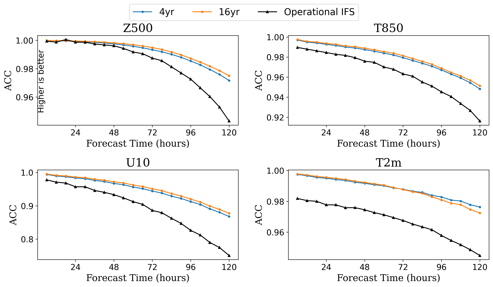
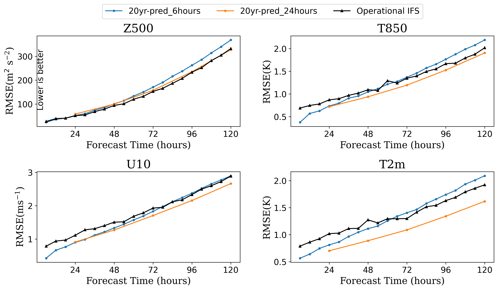

ENGLISH | [简体中文](README_CN.md)

# GraphCast: Medium-range Global Weather Forecasting Based on GNN

## Overview

GraphCast is a data-driven global weather forecast model developed by researchers from DeepMind and Google. It provides medium-term forecasts of key global weather indicators with a resolution of 0.25°. Equivalent to a spatial resolution of approximately 25 km x 25 km near the equator and a global grid of 721 x 1440 pixels in size. Compared with the previous ML-based weather forecast model, this model improves the accuarcy to 99.2% of the 252 targets.


This tutorial introduces the research background and technical path of GraphCast, and shows how to train and fast infer the model through MindEarth. More information can be found in [paper](https://arxiv.org/abs/2212.12794). The partial dataset with resolution of 1.4° and 0.25° are used in this tutorial, and the results is shown below.

## QuickStart

You can download dataset from [graphcast/dataset](https://download.mindspore.cn/mindscience/mindearth/dataset/WeatherBench_1.4_69/) for model evaluation. Save these dataset at `./dataset`.

### Run Option 1: Call `main.py` from command line

```shell
python -u ./main.py \
  --config_file_path \
  --device_target Ascend \
  --device_id 0 \
```

where:
`--config_file_path` the path of config file, default "./GraphCast.yaml".

`--device_target` device type, default 'Ascend'.

`--device_id` NPU id, default 0.

### Run Option 2: Run Jupyter Notebook

You can use [Chinese](https://gitee.com/mindspore/mindscience/raw/master/MindEarth/applications/medium-range/graphcast/graphcast_CN.ipynb) or [English](https://gitee.com/mindspore/mindscience/raw/master/MindEarth/applications/medium-range/graphcast/graphcast.ipynb) Jupyter Notebook to run the training and evaluation code line-by-line.

### Dataset

ERA5 is the fifth generation atmospheric reanalysis dataset of the European Centre for Medium Range Weather Forecasts (ECMWF) on global climate from January 1950 to present. ERA5 provides hourly estimates of a large number of atmospheric, terrestrial, and oceanic climate variables. We train our model on a subset of ERA5, preserving the highest spatial resolution available in ERA5, which is 0.25°× 0.25° on the Earth's surface, input resolution of 1440 × 721. In order to reduce computational costs, we selected 13 pressure layers (i.e. 50hPa, 100hPa, 150hPa, 200hPa, 250hPa, 300hPa, 400hPa, 500hPa, 600hPa, 700hPa, 850hPa, 925hPa, and 1000hPa) and surface variables from 37 pressure layers in the dataset as input features.

#### Input Variables for Model

| *Surface variables (5)*       | *Atmospheric variables (6)*              | *Pressure levels (37)*          |
| ------------------ | ------------------------- | ----------------- |
| **2-meter temperature** (2T) | **Temperature** (T) | 1, 2, 3, 5, 7, 10, 20, 30, **50**, 70, |
| **10 meter u wind component** (10U) | **U component of wind** (U) | **100**, 125, **150**, 175, 200, 225, |
| **10 meter v wind component** (10V) | **V component of wind** (V) | **250**, **300**, 350, **400**, 450, **500**,|
| **Mean sea-level pressure** (MSL) | **Geopotential** (Z) | 550, **600**, 650, **700**, 750, 775,|
| Total precipitation (TP) | **Specific humidity** (Q) | 800, 825, **850**, 875, 900, **925**,|
|                          | Vertical wind speed (W) | 950, 975, **1000**|

#### Multi-mesh Statistics

Meanwhile, this case provides a module for [generating regular icosahedral meshes](https://gitee.com/mindspore/mindscience/tree/master/MindEarth/applications/medium-range/graphcast/graph_processing). Users can generate multi-level grids of different scales and resolutions as needed. A multi-level grid is a spatially homogeneous graph, with the highest resolution formed by 6 iterations of a regular icosahedron (including 12 nodes, 20 faces, and 30 edges). Each iteration refines the grid by dividing a single triangle into 4 smaller triangles and projecting its nodes onto a sphere.

| *Refinement*       |   *0*   |   *1*   |   *2*   |   *3*   |   *4*    |   *5*   |   *6*   |
| ------------------ | ------ | ------ |------- | ------ | ------| ------- | ------- |
| Num Nodes | 12 | 42 | 162 | 642 | 2562 | 10242 | 40962 |
| Num Faces | 20 | 80 | 320 | 1280 | 5120 | 20480 | 81920 |
| Num Edges | 60 | 240| 960 | 3840 | 15360 | 61440 | 245760 |
| Num Multilevel Edges | 60 | 300|  1260 | 5100 | 20460 | 81900 | 327660 |

### Analysis

The following figure shows the ground truth, predicion and their errors using the checkpoint of training epoch 100.


Summary of skill score for 6-hours to 5-days lead time is shown below.


## Performance

|        Parameter         |        GPU          |        NPU       |    NPU       |        NPU       |    NPU       |
|:----------------------:|:--------------------------:|:---------------:|:---------------:|:---------------:|:---------------:|
|     Hardware         |   V100, Memory 32G  |   Ascend, Memory 32G  |  Ascend, Memory 32G  |   Ascend, Memory 64G  |   Ascend, Memory 64G  |
|     MindSpore   |        2.2.10          |      2.2.10       |       2.2.10      |      2.2.10       |      2.2.10       |
|        Dataset      |        [ERA5_1_4_tiny400](https://download.mindspore.cn/mindscience/mindearth/dataset/WeatherBench_1.4_69/)               |       [ERA5_1_4_tiny400](https://download.mindspore.cn/mindscience/mindearth/dataset/WeatherBench_1.4_69/)      | ERA5_1_4_16yr |[ERA5_0_25_tiny400](https://download-mindspore.osinfra.cn/mindscience/mindearth/dataset/ERA5_0_25/) |ERA5_0_25_20yr |
|        Parameters      |             35809280          |      35809280       |      35809280       |      35809280       |      35809280       |
|        Train parameters      |        batch_size=1,steps_per_epoch=403,epochs=100               |       batch_size=1,steps_per_epoch=403,epochs=100      | batch_size=1,steps_per_epoch=9313,epochs=200 |batch_size=1,steps_per_epoch=404,epochs=50 |batch_size=1,steps_per_epoch=914,epochs=200 |
|        Test parameters      |        batch_size=1,steps=8               |       batch_size=1,steps=8      |batch_size=1,steps=39  |batch_size=1,steps=9 |batch_size=1,steps=39 |
|        Optimizer      |   AdamW  |   AdamW  |   AdamW  |   AdamW  |   AdamW  |
|        Train loss(RMSE)      |    0.0009    |      0.0009     |    0.0009    |    0.0016    |      0.0009     |
|        Training resources     |  1Node 1GPU    |     1Node 1NPU     |    2Nodes 16NPUs     |  1Node 1NPU    |     4Nodes 32NPUs     |
|        Running time     |  5.5 hours    |     3 hours   |    124 hours    |  31 hours    |     310 hours     |
|        Z500(6h, 72h, 120h)      |       73, 567, 879      |    71, 564, 849    | 23, 157, 349 |  90, 818, 985 |  23.45, 157, 327 |
|        T850(6h, 72h, 120h)      |      0.95, 2.9, 3.8    |  0.95, 2.98, 3.96   |0.48, 1.31, 2.14 | 4.19, 19.6, 21.8 |  0.37, 1.19, 1.9 |
|        U10(6h, 72h, 120h)      |       1.23, 3.86, 4.8    |  1.21, 3.78, 4.78   |0.5, 1.78, 2.82 | 0.9, 5.0, 5.3 | 0.42, 1.7, 2.66 |
|        T2m(6h, 72h, 120h)      |       1, 3.39, 4.15    |  1.11, 3.28, 4.17   |0.63, 1.5, 2.25 | 0.94, 7.4, 10.1|  0.56, 1, 1.6 |
|        Speed(ms/step)          |  475  | 240  | 232 | 5200 | 6100 |

## More Training Results

Training with more data from [ERA5 1.40625°](https://github.com/pangeo-data/WeatherBench). By conducting hourly data training and optimizing the training results through rolling out, One can achieve a training result exceeding IFS.




By using ERA5 0.25 ° resolution data and conducting 6-hour interval data training, it is possible to achieve 20 years of data training results that surpass IFS. The following figure shows the comparison of key meteorological indicators with IFS results over a period of 5 days for training models to predict 6 hours and 24 hours.




## Precipitation

You need a pre-trained [ckpt](https://download-mindspore.osinfra.cn/mindscience/mindearth/dataset/medium_precipitation/tiny_datasets/ckpt/) of GraphCast. Set `tp: True` and modify `tp_dir`, `backbone_ckpt_path` in `GraphCastTp.yaml`.

## Run: Call `.sh` from command line

## Single-Device

```shell
cd scripts
bash run_standalone_train.sh $device_id
```

## Distribution

```shell
cd scripts
bash run_distributed_train.sh $path/to/rank_table.json $device_num $device_start_id
```

### Visualization

The following figure shows the ground truth, predicion using the checkpoint of training epoch 20.


## Contributor

gitee id: liulei277, Bokai Li, Zhou Chuansai

email: liulei2770919@163.com, 1052173504@qq.com, chuansaizhou@163.com