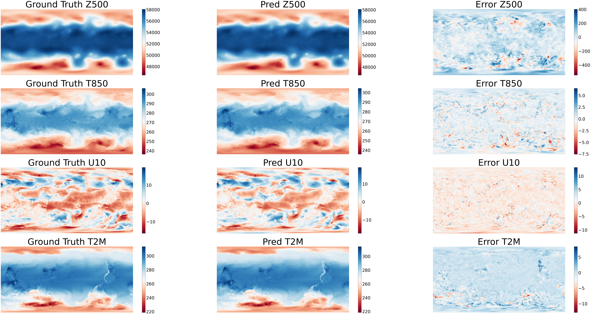
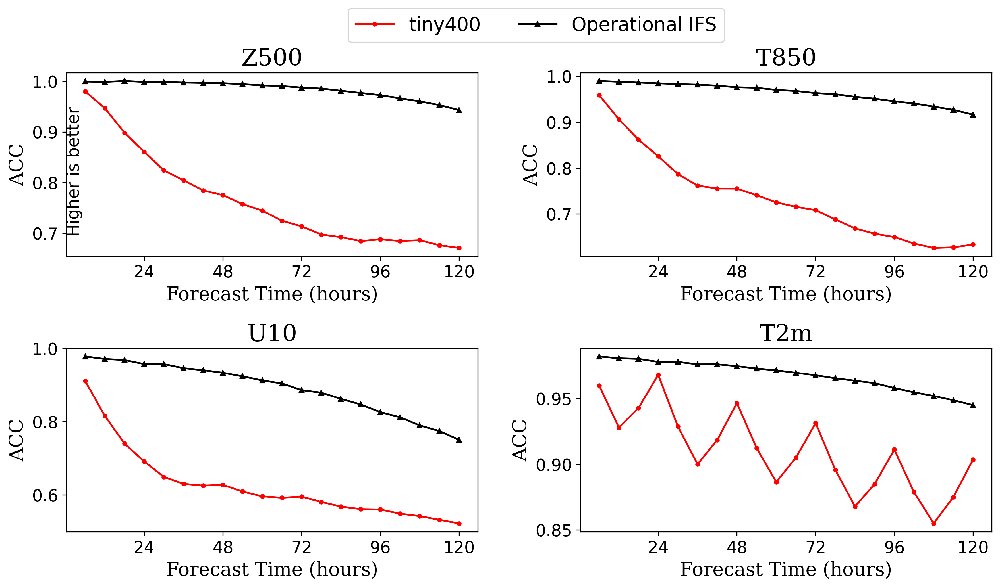
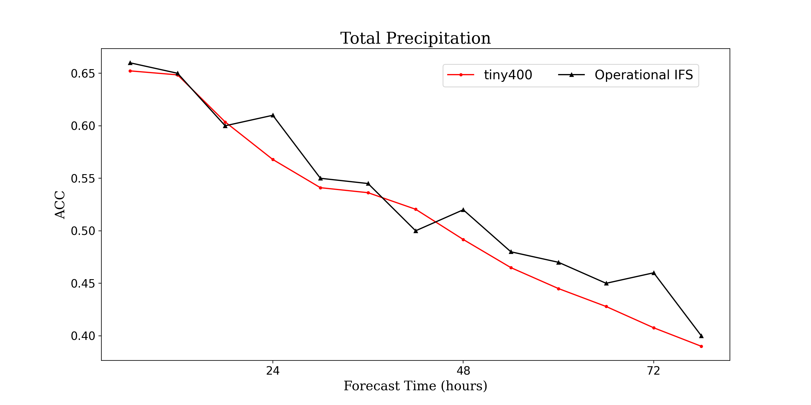
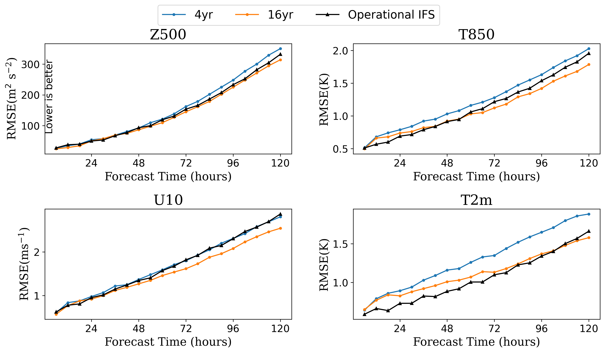
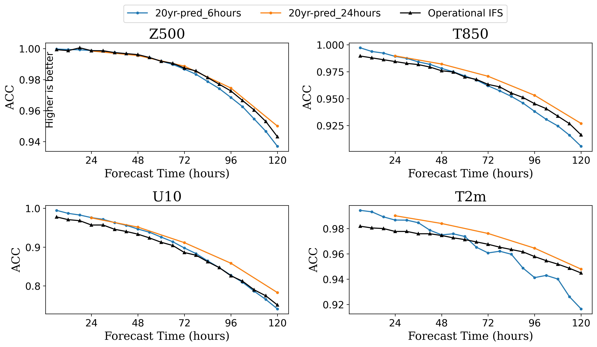

[ENGLISH](README.md) | 简体中文

# GraphCast: 基于图神经网络的全球中期天气预报

## 概述

GraphCast是由DeepMind和Google的研究人员开发的一个基于数据驱动的全球天气预报模型。它提供了关键全球天气指标的中期预报，分辨率为0.25°。相当于赤道附近约25公里x25公里的空间分辨率和大小为721 x 1440像素的全球网格。与以前的基于ML的天气预报模型相比，该模型将252个目标的准确率提高到99.2%。


本教程介绍了GraphCast的研究背景和技术路径，并展示了如何通过MindEarth训练和快速推理模型。 更多信息参见[文章](https://arxiv.org/abs/2212.12794)。本教程中使用分辨率为1.4°和0.25°的部分数据集介绍GraphCast的训练推理流程，并展示了不同规模、不同分辨率数据集的训练结果对比。

## 数据集

ERA5是ECMWF（欧洲中期天气预报中心）对1950年1月至今全球气候的第五代大气再分析数据集。ERA5提供了大量大气、陆地和海洋气候变量的每小时估计值。GraphCast在ERA5的一个子集上训练我们的模型，保留ERA5中可用的最高空间分辨率，即地球球面上0.25°×0.25°，输入分辨率为1440×721。为了减少计算成本，我们从数据集中的37个气压层中选择了13个气压层（即50hPa、100hPa、150hPa、200hPa、250hPa、300hPa、400hPa、500hPa、600hPa、700hPa、850hPa、925hPa和1000hPa）及地表变量作为输入特征。

同时，本案例提供了[正二十面体网格生成模块](https://gitee.com/mindspore/mindscience/tree/master/MindEarth/applications/medium-range/graphcast/graph_processing)， 用户可根据需要生成不同尺度和分辨率的多层级网格 。多层级网格是一个空间均质的图，最高分辨率可通过 6 次迭代正二十面体（包含12个节点，20个面和30条边）形成，每次迭代会对网格进行精细化处理，将单个三角形划分为 4 个较小的三角形，并将其节点投影至球体上。

### Backbone输入变量

| *Surface variables (5)*       | *Atmospheric variables (6)*              | *Pressure levels (37)*          |
| ------------------ | ------------------------- | ----------------- |
| **2-meter temperature** (2T) | **Temperatue** (T) | 1, 2, 3, 5, 7, 10, 20, 30, **50**, 70, |
| **10 meter u wind component** (10U) | **U component of wind** (U) | **100**, 125, **150**, 175, 200, 225, |
| **10 meter v wind component** (10V) | **V component of wind** (V) | **250**, **300**, 350, **400**, 450, **500**,|
| **Mean sea-level pressure** (MSL) | **Geopotential** (Z) | 550, **600**, 650, **700**, 750, 775,|
| Total precipitation (TP) | **Specific humidity** (Q) | 800, 825, **850**, 875, 900, **925**,|
|                          | Vertical wind speed (W) | 950, 975, **1000**|

### Multi-mesh统计值

| *Refinement*       |   *0*   |   *1*   |   *2*   |   *3*   |   *4*    |   *5*   |   *6*   |
| ------------------ | ------ | ------ |------- | ------ | ------| ------- | ------- |
| Num Nodes | 12 | 42 | 162 | 642 | 2562 | 10242 | 40962 |
| Num Faces | 20 | 80 | 320 | 1280 | 5120 | 20480 | 81920 |
| Num Edges | 60 | 240| 960 | 3840 | 15360 | 61440 | 245760 |
| Num Multilevel Edges | 60 | 300|  1260 | 5100 | 20460 | 81900 | 327660 |

### 中期降水

在下游的中期降水案例中，我们采用$0.5^{\circ} \times 0.5^{\circ}$，输入分辨率为$360 \times 720$的ERA5数据进行训练，其中模型的输入变量同上述相同。此外，为了缓解降水数据样本不均衡的特点，我们需要对Total Precipitation这一变量进行Log变换处理，以便模型训练。具体公式如下
$$
\hat{tp} = ln(\frac{tp}{\epsilon} + 1),
$$
其中$tp$表示Total Precipitation的原始数值，在我们的实验中$\epsilon=1e-5$。

## 模型运行

### 基础Backbone

运行前需先准备训练使用的数据，可根据需要下载[1.40625°](https://download.mindspore.cn/mindscience/mindearth/dataset/WeatherBench_1.4_69/)或[0.25°](https://download-mindspore.osinfra.cn/mindscience/mindearth/dataset/ERA5_0_25/)数据并保存在`./dataset`。

#### 快速开始

*方式一：命令行启动*

```shell
bash ./scripts/run_standalone_train.sh $device_id $device_target $config_file_path
```

其中：

`--device_id` 表示运行设备的编号。

`--device_target` 表示设备类型，默认"Ascend"。

`--config_file_path` 配置文件的路径，默认值"./configs/GraphCast_1.4.yaml"。

若运行0.25°分别率训练任务，`config_file_path`传入"./configs/GraphCast_0.25.yaml"即可。

*方式二: 运行Jupyter Notebook*

使用[中文](https://gitee.com/mindspore/mindscience/raw/master/MindEarth/applications/medium-range/graphcast/graphcast_CN.ipynb)或[英文](https://gitee.com/mindspore/mindscience/raw/master/MindEarth/applications/medium-range/graphcast/graphcast.ipynb) Jupyter Notebook可以逐行运行训练和推理代码。

#### 多卡并行

多卡并行需要将`config_file_path`指定的配置文件中`distribute`字段设置为`True`。

```shell
bash ./scripts/run_distributed_train.sh $rank_table_file $device_num $device_start_id $config_file_path
```

其中：

`--rank_table_file` [组网信息文件](https://www.mindspore.cn/tutorials/experts/zh-CN/r2.2/parallel/rank_table.html#%E6%A6%82%E8%BF%B0)。

`--device_num` 表示组网设备的数量。

`--device_start_id` 表示组网设备起始ID。

`--config_file_path` 配置文件的路径。

### 中期降水

运行前需下载训练使用的数据集[ERA5_0_5_tiny400](https://download-mindspore.osinfra.cn/mindscience/mindearth/dataset/medium_precipitation/tiny_datasets/)并保存在`./dataset`。此外需在`GraphCastTp.yaml`文件中设置预训练GraphCast ckpt的路径`backbone_ckpt_path`，用户可下载所提供的0.5°数据4年预训练[ckpt](https://download-mindspore.osinfra.cn/mindscience/mindearth/dataset/medium_precipitation/tiny_datasets/ckpt/)进行设置，亦可自行训练获取ckpt进行配置。

#### 快速开始

*方式一：命令行启动*

```shell
bash ./scripts/run_standalone_train.sh $device_id $device_target "./configs/GraphCastTp.yaml"
```

其中：

`--device_id` 表示运行设备的编号。

`--device_target` 表示设备类型，默认"Ascend"。

*方式二: 运行Jupyter Notebook*

使用[中文](https://gitee.com/mindspore/mindscience/raw/master/MindEarth/applications/medium-range/graphcast/graphcast_tp_CN.ipynb)或[英文](https://gitee.com/mindspore/mindscience/raw/master/MindEarth/applications/medium-range/graphcast/graphcast_tp.ipynb) Jupyter Notebook可以逐行运行训练和推理代码。

#### 多卡并行

多卡并行需要将`./configs/GraphCastTp.yaml`配置文件中`distribute`字段设置为`True`。

```shell
bash ./scripts/run_distributed_train.sh $rank_table_file $device_num $device_start_id "./configs/GraphCastTp.yaml"
```

其中：

`--rank_table_file` [组网信息文件](https://www.mindspore.cn/tutorials/experts/zh-CN/r2.2/parallel/rank_table.html#%E6%A6%82%E8%BF%B0)。

`--device_num` 表示组网设备的数量。

`--device_start_id` 表示组网设备起始ID。

### 结果展示

#### 基础要素可视化

下图展示了使用1.40625°数据[ERA5_1_4_tiny400](https://download.mindspore.cn/mindscience/mindearth/dataset/WeatherBench_1.4_69/)训练结果的第100个epoch进行推理绘制的地表、预测值和他们之间的误差。



6小时至5天的天气预报关键指标见下图。




6小时至78小时的中期降水预报指标见下图。



#### 降水可视化

下图展示使用0.5°数据[ERA5_0_5_tiny400](https://download-mindspore.osinfra.cn/mindscience/mindearth/dataset/medium_precipitation/tiny_datasets/)训练的第20个epoch绘制成的降水预报结果。


## 所有训练结果

### 1.4°基础Backbone

使用[ERA5 1.40625°](https://github.com/pangeo-data/WeatherBench)分辨率数据，进行逐小时数据训练，并对训练结果进行rollout优化，可实现16年数据训练结果超越IFS。




### 0.25°基础Backbone

使用ERA5 0.25°分辨率数据，进行6小时间隔数据训练，可实现20年数据训练结果超越IFS。下图展示了训练模型预测6小时和预测24小时，一些关键气象指标在5天内同IFS结果的对比。




### 中期降水

使用ERA5 0.5°分辨率数据，进行6小时间隔数据训练，可实现10年数据训练结果超越IFS。下图展示了在78小时内同IFS结果的对比，以及10年数据训练后绘制成的降水预报结果。


## 性能汇总

### 基础Backbone

|        参数         |       NPU     |    NPU       |  NPU       |    NPU       |      GPU    |  
|:------------------------:|:--------------------------:|:---------------:|:---------------:|:---------------:|:---------------:|
|     硬件资源         |    Ascend, Memory 64G  |   Ascend, Memory 64G  | Ascend, Memory 32G  |  Ascend, Memory 32G  |  V100, Memory 32G  |  
|     MindSpore版本   |        2.2.10          |      2.2.10       |       2.2.10      |      2.2.10       |      2.2.10       |
|        数据集      |  [ERA5_0_25_tiny400](https://download-mindspore.osinfra.cn/mindscience/mindearth/dataset/ERA5_0_25/) |ERA5_0_25_20yr |  [ERA5_1_4_tiny400](https://download.mindspore.cn/mindscience/mindearth/dataset/WeatherBench_1.4_69/)     | ERA5_1_4_16yr |  [ERA5_1_4_tiny400](https://download.mindspore.cn/mindscience/mindearth/dataset/WeatherBench_1.4_69/)  |
|        参数量      |      35 mil.          |      35 mil.       |      35 mil.       |      35 mil.      |      35 mil.    |
|        训练参数      |    batch_size=1<br>steps_per_epoch=404<br>epochs=50 | batch_size=1<br>steps_per_epoch=914<br>epochs=200 |    batch_size=1<br>steps_per_epoch=403<br>epochs=100    | batch_size=1<br>steps_per_epoch=9313<br>epochs=200 |   batch_size=1<br>steps_per_epoch=403<br>epochs=100   |
|        测试参数      |    batch_size=1<br>steps=9 | batch_size=1<br>steps=39 |    batch_size=1<br>steps=8   |batch_size=1<br>steps=39  |    batch_size=1<br>steps=8   |
|        优化器      |   AdamW  |   AdamW  |   AdamW  |   AdamW  |   AdamW  |
|        训练损失(RMSE)      |    0.0016    |   0.0009     |  0.0009    |  0.0009     |    0.0009    |  
|        Z500  (6h, 72h, 120h)      |   90, 818, 985 |  23.45, 157, 327 |   71, 564, 849    | 23, 157, 349 |    73, 567, 879      |
|        T850  (6h, 72h, 120h)      |   4.19, 19.6, 21.8 |  0.37, 1.19, 1.9 |0.95, 2.98, 3.96   |0.48, 1.31, 2.14 |  0.95, 2.9, 3.8    |
|        U10  (6h, 72h, 120h)      |    0.9, 5.0, 5.3 | 0.42, 1.7, 2.66 | 1.21, 3.78, 4.78   |0.5, 1.78, 2.82 |   1.23, 3.86, 4.8    |
|        T2m  (6h, 72h, 120h)      |    0.94, 7.4, 10.1|  0.56, 1, 1.6 | 1.11, 3.28, 4.17   |0.63, 1.5, 2.25 |  1, 3.39, 4.15    |
|        训练资源     |  1Node 1NPU    |  4Nodes 32NPUs   |  1Node 1NPU    |    2Nodes 16NPUs   |  1Node 1GPU  |
|        运行时间     |   31 hours  |   310 hours  | 3 hours  |  124 hours  | 5.5 hours  |
|        速度(ms/step)    | 5200 | 6100 | 240  | 232 |  475  |

### 中期降水

|      参数        |        NPU              |        NPU             |    GPU       |
|:----------------------:|:--------------------------:|:--------------------------:|:---------------:|
|    硬件资源        |     Ascend, memory 32G     |     Ascend, memory 32G      |     V100, memory 32G       |
|     MindSpore版本   |        2.0             |         2.2.0             |      2.2.0       |
|     数据集      |      ERA5_0_5_10yr             |      [ERA5_0_5_tiny400](https://download-mindspore.osinfra.cn/mindscience/mindearth/dataset/medium_precipitation/tiny_datasets/)     |     [ERA5_0_5_tiny400](https://download-mindspore.osinfra.cn/mindscience/mindearth/dataset/medium_precipitation/tiny_datasets/)     |
|    参数量     |    62 mil.         |          62 mil.         |        62 mil.    |
|    训练参数  |        batch_size=1<br>steps_per_epoch=8760<br>epochs=30    |    batch_size=1<br>steps_per_epoch=408<br>epochs=30     |     batch_size=1<br>steps_per_epoch=408<br>epochs=30     |
|        测试参数      |    batch_size=1<br>steps=39 | batch_size=1<br>steps=11 |    batch_size=1<br>steps=11   |
|    优化器    |        AdamW      |         AdamW              |    AdamW     |
|    训练损失(Lp)      |        0.3      |     0.3      |    0.4   |
|    准确率(Tp)    |        0.69      |     0.65    |    0.67   |
|    训练资源      | 1Node 8NPUs  | 1Node 1NPU   | 1Node 1GPU    |
|    运行时间     | 11.8 hours  | 4.4 hours   | 5.4 hours    |
|    速度(ms/step)          |     1300     |     1300       |   1650 |

## 贡献者

gitee id: liulei277, Bokai Li, Zhou Chuansai

email: liulei2770919@163.com, 1052173504@qq.com, chuansaizhou@163.com