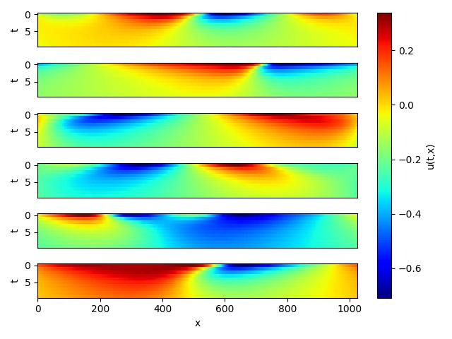

# KNO神经算子求解一维伯格斯方程

## 概述

### 问题描述

伯格斯方程（Burgers' equation）是一个模拟冲击波的传播和反射的非线性偏微分方程，被广泛应用于流体力学，非线性声学，
气体动力学等领域，它以约翰内斯·马丁斯汉堡（1895-1981）的名字命名。

一维伯格斯方程（1-d Burgers' equation）的应用包括一维粘性流体流动建模。它的形式如下：

$$
\partial_t u(x, t)+\partial_x (u^2(x, t)/2)=\nu \partial_{xx} u(x, t), \quad x \in(0,1), t \in(0, 1]
$$

$$
u(x, 0)=u_0(x), \quad x \in(0,1)
$$

其中$u$表示速度场，$u_0$表示初始条件，$\nu$表示粘度系数。

本案例利用Koopman Neural Operator学习初始状态到下一时刻状态的映射，实现一维Burgers'方程的求解：

$$
u_0 \mapsto u(\cdot, 1)
$$

### 技术路径

Koopman Neural Operator模型构架如下图所示，包含上下两个主要分支和对应输出。图中Input表示初始涡度，上路分支通过Encoding Layer实现输入向量的高维映射，然后将映射结果作为Koopman Layer的输入，进行频域信息的非线性变换，最后由Decoding Layer将变换结果映射至最终的预测结果Prediction。同时，下路分支通过Encoding Layer实现输入向量的高维映射，然后通过Decoding Layer对输入进行重建。上下两个分支的Encoding Layer之间共享权重，Decoding Layer之间也共享权重。Prediction用于和Label计算预测误差，Reconstruction用于和Input计算重建误差。两个误差共同指导模型的梯度计算。

Encoding Layer、Koopman Layer、Decoding Layer以及两分支共同组成了Koopman Neural Operator。

Koopman Layer结构如虚线框所示，可重复堆叠。向量经过傅里叶变换后，再经过线性变换，过滤高频信息，然后进行傅里叶逆变换；输出结果与输入相加，最后通过激活函数，得到输出向量。


## 快速开始

数据集下载地址：[data_driven/burgers/kno1d/dataset](https://download.mindspore.cn/mindscience/mindflow/dataset/applications/data_driven/burgers/dataset/). 将数据集保存在`./dataset`路径下.

### 训练方式一：在命令行中调用`train.py`脚本

```shell
python train.py --config_file_path ./configs/kno1d.yaml --device_target GPU --device_id 0 --mode GRAPH
```

其中，

`--config_file_path`表示配置文件的路径，默认值'./configs/kno1d.yaml'；

`--device_target`表示使用的计算平台类型，可以选择'Ascend'或'GPU'，默认值'GPU'；

`--device_id`表示使用的计算卡编号，可按照实际情况填写，默认值 0；

`--mode`表示运行的模式，'GRAPH'表示静态图模式, 'PYNATIVE'表示动态图模式。

### 训练方式二：运行 Jupyter Notebook

您可以使用[中文版](./KNO1D_CN.ipynb)和[英文版](./KNO1D.ipynb)Jupyter Notebook 逐行运行训练和验证代码。

## 结果展示

取6个样本做连续10步预测，并可视化。



## 性能

|        参数         |        Ascend               |    GPU       |
|:----------------------:|:--------------------------:|:---------------:|
|     硬件资源         |     Ascend      |      NVIDIA V100 显存32G       |
|     MindSpore版本   |        2.0.0             |      2.0.0       |
|        训练损失      |        3e-5               |       3e-5      |
|        验证损失      |        3e-3               |       3e-3    |
|        速度          |     2s/epoch        |    7s/epoch  |

## Contributor

gitee id：[dyonghan](https://gitee.com/dyonghan)

email: dyonghan@qq.com