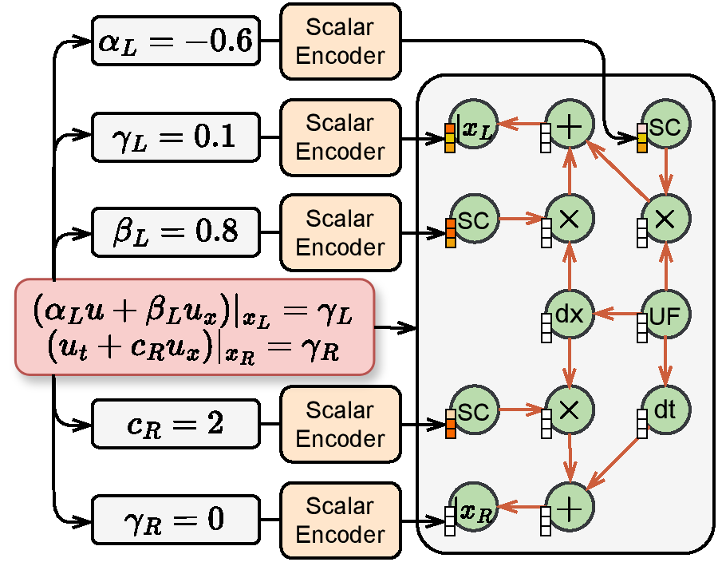
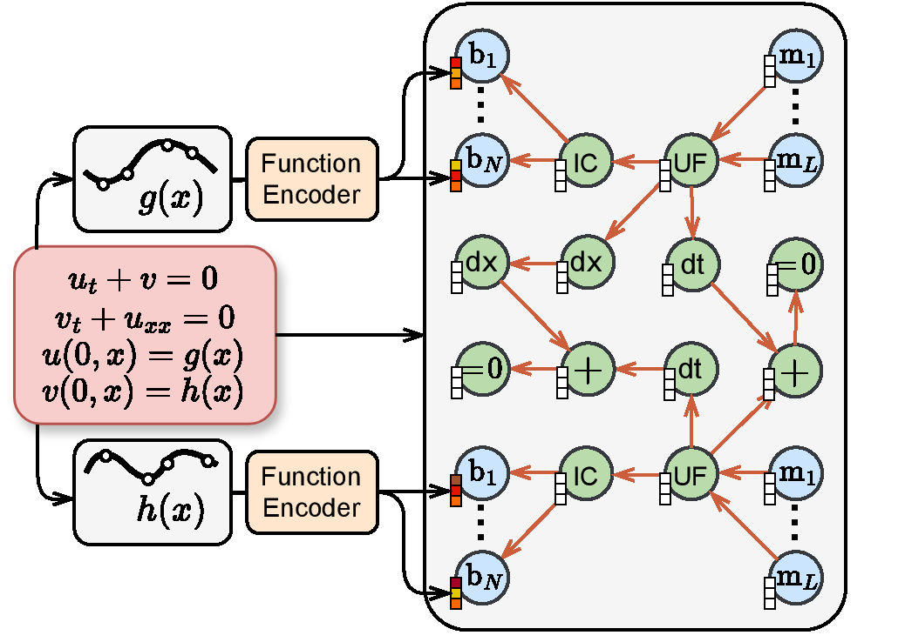

# Representation of Boundary Conditions, Coefficient Fields, and Other Elements in Computational Graph for PDEs

## Boundary Conditions

If the PDE uses periodic boundary conditions, there is no need to introduce additional nodes in the corresponding computational graph.
For non-periodic boundaries, taking the case of a left boundary Dirichlet and right boundary Neumann as an example:

(Note: Unless specifically mentioned, all scalar encoders in the diagrams below share parameters, and the same applies to function encoders.)

Here is a more complex example, with a Robin condition on the left boundary and a Mur condition on the right boundary (which is an absorbing boundary condition for wave equations):

## Non-constant Coefficients

If the coefficients involved in the PDE are not constants but a space-dependent coefficient field $s(x)$, such coefficients can be represented by a `CF` node.
The example shown below appears in equations that include a non-constant diffusion term:

Coefficients that depend on time (i.e., of the form $s(t)$, which is a function of time $t$) can also be similarly represented by a `VC` node.
By introducing additional product nodes, a variable coefficient field of the form $s^\mathrm{T}(t)s^\mathrm{X}(x)$ (which has separable variables) can be expressed in the computational graph.
The current code does not yet support representing general variable coefficient fields $s(t,x)$.

## Second-order Time Derivative

The following diagram uses a simple wave equation as an example to show how equations containing second-order time derivatives can be represented through computational graphs:

## Multivariable Equations

Systems of partial differential equations that contain multiple variables (multiple components of the equation solution) can also be represented using computational graphs. A simple example is shown below (although we currently do not provide model parameters trained on multi-component equation data):

