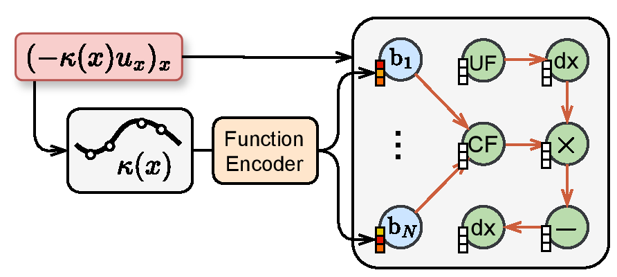

# PDE 中边界条件、系数场等元素在计算图中的表达方式

## 边界条件

PDE 若采用周期边界条件，相应的计算图中无需引入额外节点。
对于非周期边界，以左边界 Dirichlet、右边界 Neumann 的情形为例：

（注：如无特别说明，以下示意图中所有的 scalar encoder 都共享参数，function encoder 也是如此。）

以下是一个更复杂的例子，其左边界为 Robin，右边界为 Mur（这是一种针对波方程的吸收边界条件）：

## 非常数系数

如果 PDE 中涉及的系数不是常数，而是一个有空间依赖的系数场 $s(x)$ ，这样的系数可以通过一个 `CF` 节点表示。
下图所展示的例子在包含非常数扩散项的方程中会出现：

有时间依赖的系数（即形如 $s(t)$，它是一个关于时间 $t$ 的函数）也可以类似地用一个 `VC` 节点表示。
通过引入额外的乘积节点，可以在计算图中表达出 $s^\mathrm{T}(t)s^\mathrm{X}(x)$ 这样的（可分离变量的）可变系数场。
目前的代码暂时不支持表示一般形式的可变系数场 $s(t,x)$。

## 时间二阶导

下图以简单的波方程为例，展示了含有时间二阶导数的方程如何通过计算图来表示：

## 多变量方程组

含有多个变量（方程解的多个分量）的偏微分方程组也可以使用计算图表示，一个简单的示例如下（尽管我们目前还没有提供在多分量方程数据上训练过的模型参数）：

