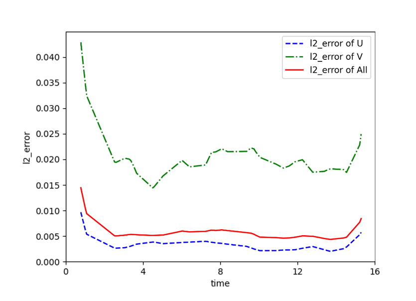

ENGLISH | [简体中文](README_CN.md)

# inverse Navier Stokes problem

## Overview

The inverse problem of Navier-Stokes is that of solving the fluid properties (e.g., viscosity, density, etc.) and fluid boundary conditions (e.g., wall friction, etc.) that can produce certain fluid motion characteristics (e.g., flow rate, velocity, etc.), given that these characteristics are known Problem. Unlike the positive problem (i.e., the fluid properties and boundary conditions are known and the kinematic characteristics of the fluid are solved), the solution of the inverse problem needs to be solved by numerical optimization and inverse extrapolation methods.

|Correct PDE|Identified PDE|
|  ----  | ----  |
|$u_t + (u u_x + v u_x) = - p_x + 0.01(u_{xx} + u_{yy})$|$u_t + 0.9984444 (u u_x + v u_x) = - p_x + 0.01072927(u_{xx} + u_{yy})$|
|$v_t + (u v_x + v v_x) = - p_y + 0.01(v_{xx} + v_{yy})$|$v_t + 0.9984444 (u v_x + v v_x) = - p_y + 0.01072927(v_{xx} + v_{yy})$|

[See More](https://gitee.com/mindspore/mindscience/blob/master/MindFlow/applications/physics_driven/navier_stokes_inverse/navier_stokes_inverse.ipynb)
