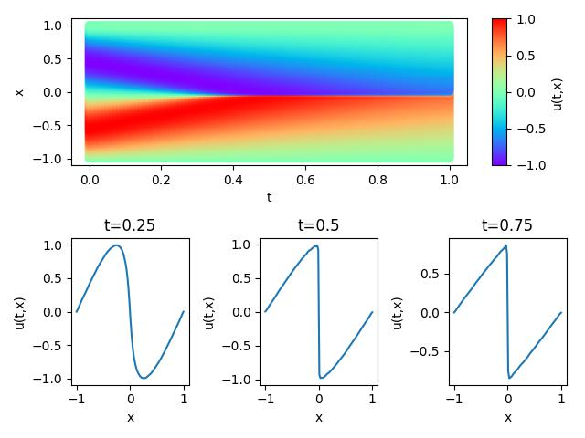
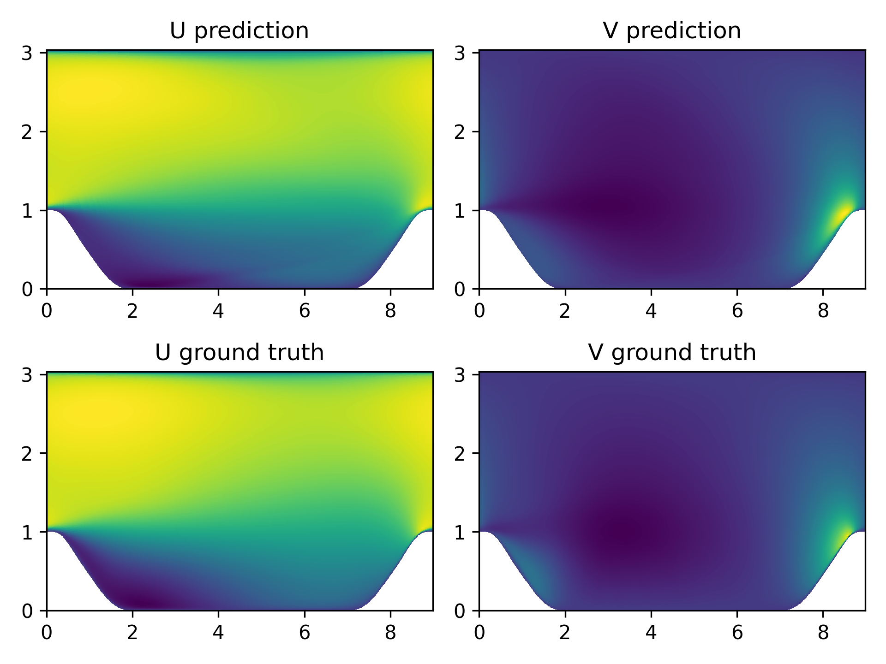

[ENGLISH](README.md) | 简体中文

# R-DLGA方法

## 概述

### 背景介绍

偏微分方程的数据驱动发现近年来取得了长足的发展。基于稀疏回归和基于神经网络的方法已经解决了几个方面的问题。然而，现有方法在处理高噪声的稀疏数据、高阶导数和激波等复杂情况时，性能缺乏稳定性，给精确计算导数带来了障碍。因此，提出了一个鲁棒的结合了物理信息神经网络的PDE发现框架——鲁棒深度学习遗传算法(R-DLGA)。

在该框架中，将DLGA提供的势项的初步结果作为物理约束加入到PINN的损失函数中，以提高导数计算的准确性。通过消除误差补偿项，有助于优化初步结果并获得最终发现的PDE。

### 技术路线

R-DLGA方法是由论文[《Robust discovery of partial differential equations in complex situations》](https://journals.aps.org/prresearch/abstract/10.1103/PhysRevResearch.3.033270)提出并实现的。

鲁棒深度学习遗传算法(R-DLGA)的工作流程，包括DLGA步骤和物理信息神经网络(PINN)步骤：

- 利用神经网络从现有数据中构建代理模型
- 利用广义遗传算法识别潜在项
- 将发现的势项添加到损失函数$L_{PINN}(θ)$中作为物理约束进一步优化导数
- 发现最终的偏微分方程PDE

### 验证方程

#### Burgers方程简介

伯格斯方程（Burgers' equation）是一个模拟冲击波的传播和反射的非线性偏微分方程。

Burgers'方程的形式如下：

$$
u_t + uu_x = \epsilon u_{xx}, \quad x \in[-1,1], t \in[0, T],
$$

其中$\epsilon=0.01/\pi$，等号左边为对流项，右边为耗散项，本案例使用迪利克雷边界条件和正弦函数的初始条件，形式如下：

$$
u(t, -1) = u(t, 1) = 0,
$$

$$
u(0, x) = -sin(\pi x),
$$

#### Navier-Stokes方程简介

圆柱绕流，即二维圆柱低速非定常绕流，流动特性与雷诺数`Re`有关。

纳维-斯托克斯方程（Navier-Stokes equation），简称`N-S`方程，是流体力学领域的经典偏微分方程，在粘性不可压缩情况下，无量纲`N-S`方程的形式如下：

$$
\frac{\partial u}{\partial x} + \frac{\partial v}{\partial y} = 0
$$

$$
\frac{\partial u} {\partial t} + u \frac{\partial u}{\partial x} + v \frac{\partial u}{\partial y} = - \frac{\partial p}{\partial x} + \frac{1} {Re} (\frac{\partial^2u}{\partial x^2} + \frac{\partial^2u}{\partial y^2})
$$

$$
\frac{\partial v} {\partial t} + u \frac{\partial v}{\partial x} + v \frac{\partial v}{\partial y} = - \frac{\partial p}{\partial y} + \frac{1} {Re} (\frac{\partial^2v}{\partial x^2} + \frac{\partial^2v}{\partial y^2})
$$

#### 雷诺平均Navier-Stokes方程

雷诺平均Navier-Stokes方程求解周期山流动问题是流体力学和气象学领域中的一个经典数值模拟案例，用于研究空气或流体在周期性山地地形上的流动行为。雷诺平均动量方程如下：

$$\rho \bar{u}_j \frac{\partial \bar{u}_i}{\partial x_j}=\rho {\bar{f}}\_ i + \frac{\partial}{\partial x_j}\left[-\bar{p} {\delta \_ {i j}+}\mu\left(\frac{\partial \bar{u}_i}{\partial x_j}+\frac{\partial \bar{u}_j}{\partial x_i}\right)-\rho \overline{u_i^{\prime} u_j^{\prime}}\right]$$

## 快速开始

从[physics_driven/burgers_pinns/dataset](https://download.mindspore.cn/mindscience/mindflow/dataset/applications/physics_driven/burgers_pinns/dataset/)、[physics_driven/cylinder_flow_pinns/dataset](https://download.mindspore.cn/mindscience/mindflow/dataset/applications/physics_driven/flow_past_cylinder/dataset/) 、[dataset/periodic_hill_2d/](https://download.mindspore.cn/mindscience/mindflow/dataset/periodic_hill_2d/)中下载验证所需要的数据集，并保存在`./dataset`目录下。

### 训练方式一：在命令行中调用`train.py`脚本、根据train.py脚本运行的结果修改util.py中term的计算方式以及train_pinn中term的表达式而后运行`train_pinn.py`脚本。

```shell
python train.py --case burgers --mode GRAPH --device_target Ascend --device_id 0 --config_file_path ./configs/burgers.yaml
```

```shell
python train_pinn.py --case burgers --mode GRAPH --device_target Ascend --device_id 0 --config_file_path ./configs/burgers.yaml
```

其中，
`--case`表示案例的选择，'burgers'表示选择burgers方程，'cylinder_flow'表示选择Navier-Stokes方程的圆柱绕流数据集，'periodic_hill'表示选择雷诺平均Navier-Stokes方程对周期山数据集进行训练。

`--mode`表示运行的模式，'GRAPH'表示静态图模式, 'PYNATIVE'表示动态图模式，详见[MindSpore官网](https://www.mindspore.cn/docs/zh-CN/r2.0.0-alpha/design/dynamic_graph_and_static_graph.html?highlight=pynative)，默认值'GRAPH'；

`--device_target`表示使用的计算平台类型，可以选择'Ascend'或'GPU'，默认值'Ascend'；

`--device_id`表示使用的计算卡编号，可按照实际情况填写，默认值0；

`--config_file_path`表示参数文件的路径，默认值'./configs/burgers.yaml'；

### 训练方式二：运行Jupyter Notebook

您可以使用[中文版](https://gitee.com/xingzhongfan/mindscience/blob/master/MindFlow/applications/research/r_dlga/r_dlga_part1_CN.ipynb)和[英文版](https://gitee.com/xingzhongfan/mindscience/blob/master/MindFlow/applications/research/r_dlga/r_dlga_part1.ipynb)Jupyter Notebook逐行运行训练和验证代码。

## 结果展示

### Burgers方程上的验证效果

本方法首先从5000个训练样本数据中构建代理模型、获取元数据并保存，进行遗传算法获得预测方程的右侧潜在项，而后根据该潜在项进行PINN模型的训练，最后本方法发现的Burgers方程为

$$
u_t + 0.43811008 * uu_x =  0.00292014 * u_{xx},
$$

验证效果如下：



### Navier-Stokes方程在Cylinder_flow数据集上的验证效果

本方法首先从36000个训练样本数据中构建代理模型、获取元数据并保存，进行遗传算法获得预测方程的右侧潜在项，而后根据该潜在项进行PINN模型的训练，最后本方法发现的Navier-Stokes方程为：
$$
u_t + 0.26797492 * u_x + 0.55881415 * u * v_y - 0.2171481 * p = 0 \\
v_t + 0.79272866 * v - 0.19479636 * v_x - 0.05810321 * p_y = 0\\
p_t + 0.63546702 * p_x + 0.22271018 * p = 0  \\
$$
验证效果如下：


### 雷诺平均Navier-Stokes方程上的验证效果

本方法首先从36000个训练样本数据中构建代理模型、获取元数据并保存，进行遗传算法获得预测方程的右侧潜在项，而后根据该潜在项进行PINN模型的训练，最后本方法发现的RANS方程为：
$$
u + 0.12345678 * u_x - 0.54321098 * u_y * v_y + 0.24681357 * p_x = 0 \\
0.78901234 * v_x - 0.45678901 * v_y - 0.01234567 * p_y = 0\\
0.65432109 * v_x + 0.86420975 * p_x= 0  \\
$$
验证效果如下：



## 性能

### Burgers方程

|        参数         |        NPU               |    GPU       |
|:----------------------:|:--------------------------:|:---------------:|
|     硬件资源         |     Ascend, 显存32G      |      NVIDIA V100 显存32G       |
|     MindSpore版本   |        2.0.0             |      2.0.0       |
|     数据集         |      [Burgers数据集](https://download.mindspore.cn/mindscience/mindflow/dataset/applications/physics_driven/burgers_pinns/)             |      [Burgers数据集](https://download.mindspore.cn/mindscience/mindflow/dataset/applications/physics_driven/burgers_pinns/)       |
|      参数量       |       2751       |         2751         |
|      训练参数     | batch_size=5000, steps_per_epoch=1, epochs=30000 | batch_size=5000, steps_per_epoch=1, epochs=30000 |
|     测试参数      |  batch_size=10000, steps=1  | batch_size=10000, steps=1 |
|     优化器         |        Adam     |        Adam         |
|     训练损失(MSE)    |  2.78e-4  | 3.05e-4 |
|        验证损失(RMSE)     |    0.0792    |       0.0838       |
|     速度(ms/step)   |  270  | 284  |

### Navier-Stokes方程

|        参数         |    NPU |    GPU    |
|:----------------------:|:---------------:|:---------------:|
|     硬件资源         | Ascend, 显存32G | NVIDIA V100 显存32G |
|     MindSpore版本   |      2.0.0  |      2.0.0  |
|     数据集         | [cylinder_flow数据集](https://download.mindspore.cn/mindscience/mindflow/dataset/applications/physics_driven/flow_past_cylinder/dataset/) | [cylinder_flow数据集](https://download.mindspore.cn/mindscience/mindflow/dataset/applications/physics_driven/flow_past_cylinder/dataset/) |
|      参数量       |         17411         |         17411         |
|      训练参数     | batch_size=10000, steps_per_epoch=4, epochs=30000 | batch_size=10000, steps_per_epoch=4, epochs=30000 |
|     测试参数      | batch_size=10000, steps=8 | batch_size=10000, steps=8 |
|     优化器         |        Adam     |        Adam     |
|     训练损失(MSE)    |     2.37e-4     |    1.90e-4 |
|        验证损失(RMSE)     |       0.0297       |       0.0276       |
|     速度(ms/step)   |  1173  |  1152  |

### 雷诺平均Navier-Stokes方程

|        参数         |    NPU |    GPU    |
|:----------------------:|:---------------:|:---------------:|
|     硬件资源         | Ascend, 显存32G | NVIDIA V100 显存32G |
|     MindSpore版本   |      2.0.0  |      2.0.0  |
|     数据集         | [Periodic_hill数据集](https://download.mindspore.cn/mindscience/mindflow/dataset/periodic_hill_2d/) | [Periodic_hill数据集](https://download.mindspore.cn/mindscience/mindflow/dataset/periodic_hill_2d/) |
|      参数量       |         17383         |         17383         |
|      训练参数     | batch_size=10000, steps_per_epoch=4, epochs=30000 | batch_size=10000, steps_per_epoch=4, epochs=30000 |
|     测试参数      | batch_size=10000, steps=8 | batch_size=10000, steps=8 |
|     优化器         |        Adam     |        Adam     |
|     训练损失(MSE)    |  2.45e-4 |  2.83e-4 |
|        验证损失(RMSE)     |       0.0231       |       0.0267       |
|     速度(ms/step)   |  2390  |  2450  |

## Contributor

gitee id: [lin109](https://gitee.com/lin109)

email: 1597702543@qq.com